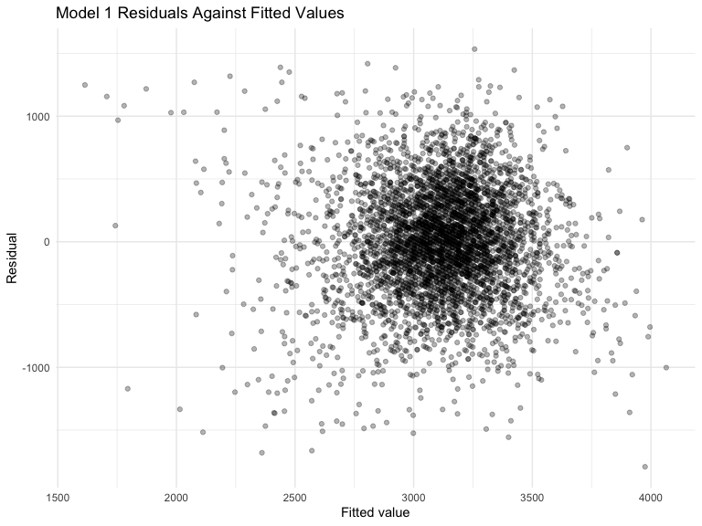
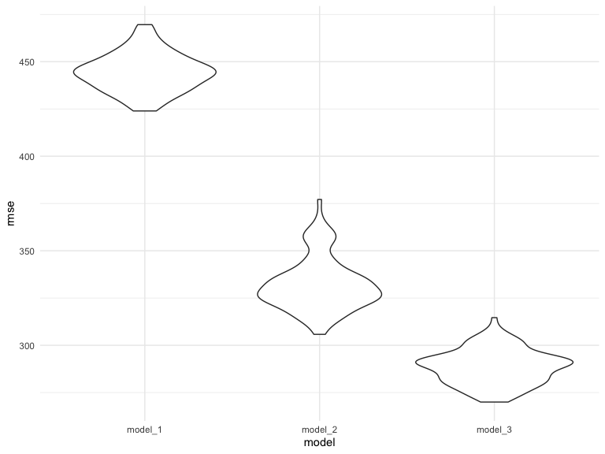
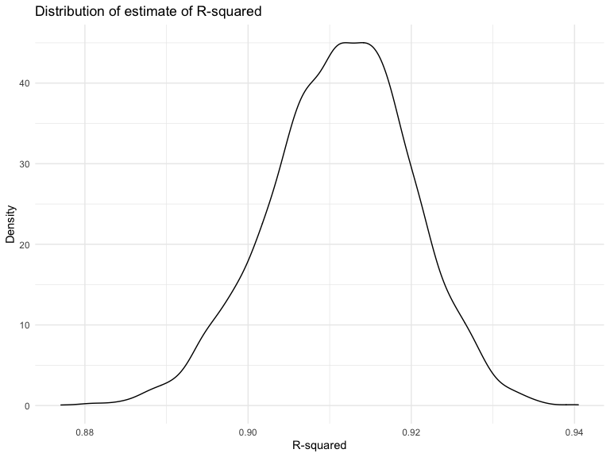
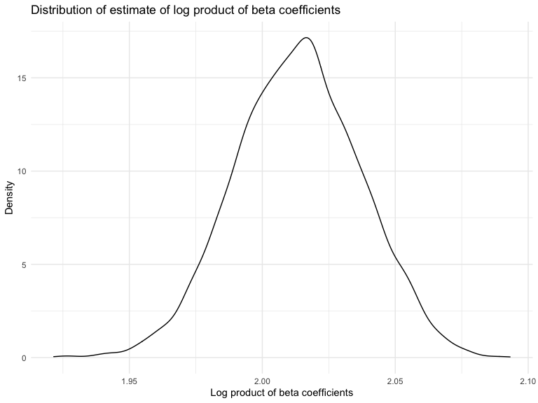

Homework 6
================
Yuanxin Zhang

This is my solution to Homework 6.

## Problem 1

Create a city\_state variable (e.g. “Baltimore, MD”), and a binary
variable indicating whether the homicide is solved. Omit cities Dallas,
TX; Phoenix, AZ; and Kansas City, MO – these don’t report victim race.
Also omit Tulsa, AL – this is a data entry mistake. For this problem,
limit your analysis those for whom victim\_race is white or black. Be
sure that victim\_age is numeric.

``` r
homicide_df = 
  read_csv("data/homicide-data.csv", na = c("", "NA", "Unknown")) %>% 
  mutate(
    city_state = str_c(city, state, sep = ", "),
    victim_age = as.numeric(victim_age),
    resolution = case_when(
      disposition == "Closed without arrest" ~ 0,
      disposition == "Open/No arrest"        ~ 0,
      disposition == "Closed by arrest"      ~ 1)
  ) %>% 
  filter(
    victim_race %in% c("White", "Black"),
    city_state != "Tulsa, AL") %>% 
  select(city_state, resolution, victim_age, victim_race, victim_sex)
```

Start with one city. For the city of Baltimore, MD, use the glm function
to fit a logistic regression with resolved vs unresolved as the outcome
and victim age, sex and race as predictors. Obtain the estimate and
confidence interval of the adjusted odds ratio for solving homicides
comparing non-white victims to white victims keeping all other variables
fixed.

``` r
baltimore_df =
  homicide_df %>% 
  filter(city_state == "Baltimore, MD")
glm(resolution ~ victim_age + victim_race + victim_sex, 
    data = baltimore_df,
    family = binomial()) %>% 
  broom::tidy() %>% 
  mutate(
    OR = exp(estimate),
    CI_lower = exp(estimate - 1.96 * std.error),
    CI_upper = exp(estimate + 1.96 * std.error)
  ) %>% 
  select(term, OR, starts_with("CI")) %>% 
  knitr::kable(digits = 3)
```

| term              |    OR | CI\_lower | CI\_upper |
| :---------------- | ----: | --------: | --------: |
| (Intercept)       | 1.363 |     0.975 |     1.907 |
| victim\_age       | 0.993 |     0.987 |     1.000 |
| victim\_raceWhite | 2.320 |     1.648 |     3.268 |
| victim\_sexMale   | 0.426 |     0.325 |     0.558 |

Try this across cities. Extract the adjusted odds ratio (and CI) for
solving homicides comparing Black victims to white victims.

``` r
models_results_df = 
  homicide_df %>% 
  nest(data = -city_state) %>% 
  mutate(
    models = 
      map(.x = data, ~glm(resolution ~ victim_age + victim_race + victim_sex, data = .x, family = binomial())),
    results = map(models, broom::tidy)
  ) %>% 
  select(city_state, results) %>% 
  unnest(results) %>% 
  mutate(
    OR = exp(estimate),
    CI_lower = exp(estimate - 1.96 * std.error),
    CI_upper = exp(estimate + 1.96 * std.error)
  ) %>% 
  select(city_state, term, OR, starts_with("CI")) 
```

Create a plot that shows the estimated ORs and CIs for each city.
Organize cities according to estimated OR, and comment on the plot.

``` r
models_results_df %>% 
  filter(term == "victim_sexMale") %>% 
  mutate(city_state = fct_reorder(city_state, OR)) %>% 
  ggplot(aes(x = city_state, y = OR)) + 
  geom_point() + 
  geom_errorbar(aes(ymin = CI_lower, ymax = CI_upper)) + 
  theme(axis.text.x = element_text(angle = 90, hjust = 1))
```


## Problem 2

Load and clean the data for regression analysis (i.e. convert numeric to
factor where appropriate, check for missing data, etc.).

``` r
birthweight_df = 
  read_csv("./data/birthweight.csv") %>% 
  
  mutate(
    babysex = case_when(
      babysex == 1 ~ "Male",
      babysex == 2 ~ "Female"
    ) %>% as.factor(),
    
    frace = case_when(
      frace == 1 ~ "White",
      frace == 2 ~ "Black",
      frace == 3 ~ "Asian",
      frace == 4 ~ "Puerto Rican",
      frace == 8 ~ "Other",
      frace == 9 ~ "Unknown"
    ) %>% as.factor(),
    
    malform = case_when(
      malform == 0 ~ "Absent",
      malform == 1 ~ "Present"
    ) %>% as.factor(),
    
    mrace = case_when(
      mrace == 1 ~ "White",
      mrace == 2 ~ "Black",
      mrace == 3 ~ "Asian",
      mrace == 4 ~ "Puerto Rican",
      mrace == 8 ~ "Other",
      mrace == 9 ~ "Unknown"
    ) %>% as.factor()
  )
```

Baby’s sex, father’s race, presence of malformations that could affect
weight, and mother’s race were converted to factor. The birthweight
dataset has 4342 rows and 20columns. There is 0 missing data in baby’s
birth weight (grams).

<br>

I proposed my regression model for birthweight based on the finding of
this
[paper](https://www.sciencedirect.com/science/article/abs/pii/0002937882906275),
which suggests that the sex of the baby, parity, maternal smoking during
the pregnancy, maternal height, weight and gestation were significant
factors.

``` r
model1_fit = lm(bwt ~ babysex + parity + smoken + mheight + delwt + gaweeks, data = birthweight_df)

model1_fit %>% 
  broom::tidy() %>% 
  select(term, estimate, p.value) %>% 
  knitr::kable(digits = 3)
```

| term        |   estimate | p.value |
| :---------- | ---------: | ------: |
| (Intercept) | \-1199.364 |   0.000 |
| babysexMale |     97.778 |   0.000 |
| parity      |    131.319 |   0.045 |
| smoken      |    \-7.451 |   0.000 |
| mheight     |     17.538 |   0.000 |
| delwt       |      4.750 |   0.000 |
| gaweeks     |     63.135 |   0.000 |

``` r
birthweight_df %>% 
  modelr::add_predictions(model1_fit) %>% 
  modelr::add_residuals(model1_fit) %>% 
  ggplot(aes(x = pred, y = resid)) + 
  geom_point(alpha = 0.3) +
  labs(
    title = "Model 1 Residuals Against Fitted Values",
    x = "Fitted value",
    y = "Residual"
  )
```



From the “Model 1 Residuals Against Fitted Values” plot, most residuals
randomly scatter around 0, indicating that the assumption of normality
for residuals is not violated.

<br>

Compare my model to two others in terms of the cross-validated
prediction error: \* Model 2 using length at birth and gestational age
as predictors (main effects only) \* Model 3 using head circumference,
length, sex, and all interactions (including the three-way interaction)
between these.

``` r
cv_df =
  crossv_mc(birthweight_df,100) %>% 
  mutate(
    train = map(train, as_tibble),
    test = map(test, as_tibble))

cv_df = 
  cv_df %>% 
  mutate(
    model_1 = map(train, ~lm(bwt ~ babysex + parity + smoken + mheight + delwt + gaweeks, data = .x)),
    model_2 = map(train, ~lm(bwt ~ blength + gaweeks, data = .x)),
    model_3 = map(train, ~lm(bwt ~ bhead * blength * babysex, data = .x))) %>% 
  mutate(
    rmse_model_1 = map2_dbl(model_1, test, ~rmse(model = .x, data = .y)),
    rmse_model_2 = map2_dbl(model_2, test, ~rmse(model = .x, data = .y)),
    rmse_model_3 = map2_dbl(model_3, test, ~rmse(model = .x, data = .y)))

cv_df %>% 
  select(starts_with("rmse")) %>% 
  pivot_longer(
    everything(),
    names_to = "model", 
    values_to = "rmse",
    names_prefix = "rmse_") %>% 
  mutate(model = fct_inorder(model)) %>% 
  ggplot(aes(x = model, y = rmse)) + geom_violin()
```



In terms of the cross-validated prediction error, Model 3, which used
head circumference, length, sex, and all interactions, is the best
model. (the smaller the RMSE, the better the model)

## Problem 3

Import the 2017 Central Park weather data.

``` r
weather_df = 
  rnoaa::meteo_pull_monitors(
    c("USW00094728"),
    var = c("PRCP", "TMIN", "TMAX"), 
    date_min = "2017-01-01",
    date_max = "2017-12-31") %>%
  mutate(
    name = recode(id, USW00094728 = "CentralPark_NY"),
    tmin = tmin / 10,
    tmax = tmax / 10) %>%
  select(name, id, everything())
```

Use 5000 bootstrap samples and, for each bootstrap sample, produce
estimates of R-squared and log product of beta coefficients.

``` r
boot_results =
  weather_df %>% 
  bootstrap(5000, id = "strap_number") %>% 
  mutate(
    models = map(.x = strap, ~lm(tmax ~ tmin, data = .x)), 
    r_squared = map(models, broom::glance),
    coefficient = map(models, broom::tidy)
  ) %>% 
  select(strap_number, r_squared, coefficient) %>% 
  unnest(r_squared) %>% 
  select(strap_number, r.squared, coefficient) %>% 
  unnest(coefficient) %>% 
  janitor::clean_names() %>% 
  select(strap_number:estimate) %>% 
  pivot_wider(
    everything(),
    names_from = term, 
    values_from = estimate) %>% 
  rename(
    beta_0 = "(Intercept)",
    beta_1 = "tmin"
  ) %>% 
  mutate(log_product_coef = log(beta_0 * beta_1))
```

Plot the distribution of estimates.

``` r
boot_results %>% 
  ggplot(aes(x = r_squared)) +
  geom_density() +
  labs(
    title = "Distribution of estimate of R-squared",
    x = "R-squared",
    y = "Density"
  ) 
```



``` r
boot_results %>% 
  ggplot(aes(x = log_product_coef)) +
  geom_density() +
  labs(
    title = "Distribution of estimate of log product of beta coefficients",
    x = "Log product of beta coefficients",
    y = "Density"
  ) 
```



The distribution of estimate of R-squared is approximately normal
(slightly left-skewed), with the peak around 0.91. The distribution of
estimate of log product of beta coefficients is approximately normal,
with the peak around 2.02.

Construct bootstrap CI.

``` r
boot_results %>% 
  summarize(
    r_squared_ci_lower = quantile(r_squared, 0.025),
    r_squared_ci_upper = quantile(r_squared, 0.975)
  ) %>% 
  knitr::kable()
```

| r\_squared\_ci\_lower | r\_squared\_ci\_upper |
| --------------------: | --------------------: |
|             0.8936977 |             0.9274807 |

``` r
boot_results %>% 
  summarize(
    log_product_coef_ci_lower = quantile(log_product_coef, 0.025),
    log_product_coef_ci_upper = quantile(log_product_coef, 0.975)
  )  %>% 
  knitr::kable()
```

| log\_product\_coef\_ci\_lower | log\_product\_coef\_ci\_upper |
| ----------------------------: | ----------------------------: |
|                      1.966942 |                      2.058528 |
